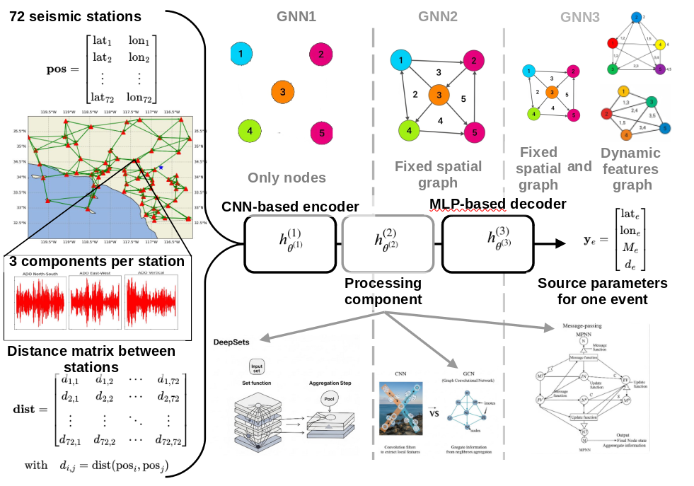
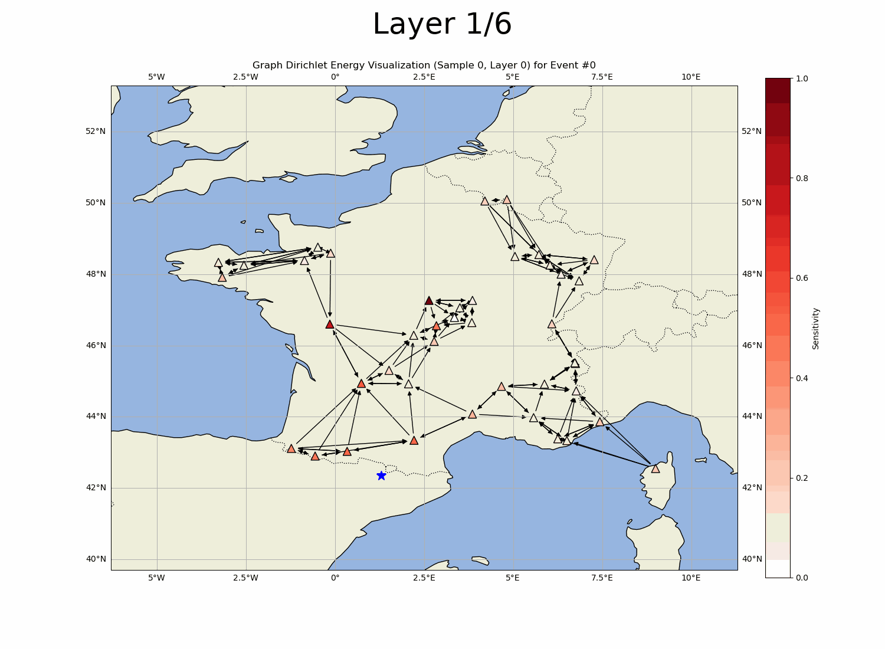

                     

**Authors :** Xavier Cassagnou1,2, Aurélien Casagrandi1,4, <ins>Elodie Noëlé</ins>1,3, Christophe Millet1,2, Mathilde Mougeot2,4

**Affiliation :** 

1CEA DAM DIF

2Centre Borelli, ENS Paris-Saclay, Université Paris-Saclay 

3DGA

4ENSIIE

**Corresponding author:** [christophe.millet@cea.fr](mailto:christophe.millet@cea.fr)

**Link to the article:** X. Cassagnou et al., **Dynamic graph neural networks for seismic characterization** (To be published)

The data and models in this tutorial will be published upon acceptation of the article.

**Date :** 19th June 2025

**License :** MIT

---

## Run on Google Colab

You can try out the code and materials using the following resources:

- ▶️ **[Open in Google Colab](https://colab.research.google.com/drive/your-colab-notebook-link)**
- 📁 **[Download Materials from Google Drive](https://drive.google.com/drive/folders/your-folder-id)**

## Run on Binder

- 

---

## Repository Content

| Folder/File         | Description |
|---------------------|-------------|
| `modules/`          | Source code for the main model and utilities. |
| `oversmoothing/`    | Source code and plots for the oversmoothing part. |
| `data/`             | Sample synthetic or preprocessed datasets. |
| `images/`           | Images |
| `README.md`         | This file. |

---

## Visual Overview

### Animated Output (Training or Results)

---

## License

[MIT](LICENSE) 

---

